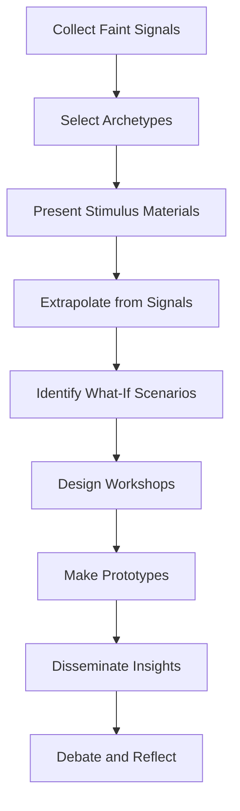

---
authors:
  - Julian Bleecker
  - Nick Foster
  - Fabien Girardin
  - Nicolas Nova
title: The Manual of Design Fiction
date: 2024-12-10
tags:
  - books
  - literature-note
---

## Summary

**Design Fiction** is a method for exploring and understanding plausible futures by blending science facts, design, and science fiction. At its core, it treats the future as a verb: a process, not a destination. This approach uses **diegetic prototypes** (props that focus imagination and provoke debate) to uncover blind spots, challenge assumptions, and create actionable provocations.

One of the most compelling aspects of design fiction is its ability to bridge **multidisciplinary collaboration** and create shared language across teams. By crafting physical, relatable artifacts, it makes speculative futures tangible and accessible, enabling organizations to explore the implications of their decisions without the pressure of immediate implementation.

The book emphasizes **the future mundane**, the process by which extraordinary innovations become integrated into everyday life. It highlights the importance of using speculative prototypes to de-risk moonshot ideas, focusing on their implications rather than striving for perfection. The **stages of design fiction**—from collecting faint signals to prototyping and sparking debate—serve as a structured way to make futures actionable and relatable.

## Highlights

**Design Fiction** is a practice that explores plausible futures by blending science facts, design, and science fiction. It shifts our perspective, treating the future as a verb—a process of becoming, rather than a fixed destination. By using **diegetic prototypes**, it allows us to uncover blind spots, challenge assumptions, and create actionable provocations.

### **Key Concepts and Insights**

- **Blending Facts and Fiction**:
Design fiction uses props, much like cinema’s _MacGuffins_, to focus imagination. These prototypes are not meant to be perfect products but tools to spark debate and provoke reflection about implications.

- **Profound Technologies**:
Technologies that truly shape the future often “disappear” into the fabric of everyday life (_ubiquitous computing_). Design fiction helps us understand these transitions.

- **The Future Mundane**:
A critical concept where extraordinary innovations become part of our mundane experiences, helping us imagine futures that are slightly off yet relatable.

- **Collaboration**:
Multidisciplinary approaches lower barriers to fruitful collaboration by creating shared language and experiences. This encourages cross-team synergy while avoiding _innovation theater_, which prioritizes superficial metrics over meaningful exploration.

### **Prototyping and Stages**

The process of design fiction involves several stages to guide speculative thinking and tangible outcomes:

**Practical Applications**

- **Artifact Creation**:
Physical prototypes make speculative futures relatable and engaging. They align with audience needs, helping translate abstract ideas into actionable insights.

-  **De-risking Innovation**:
Design fiction transforms moonshot ideas into functioning business models by addressing unknowns through speculative prototypes. This process minimizes risk and makes decisions more informed.

- **Stats vs. Design Fiction**:
While statistics are essential for daily operations, design fiction provides a framework to explore and understand possible futures.

### **Examples**

-  **Fabien’s Prototype for BBVA**:
Fabien developed a hypothetical recommendation app to provide BBVA with an outsider’s perspective. This example highlights how design fiction can transform challenges into opportunities.

- **Elena Alfaro’s Work**:
Alfaro demonstrated how design fiction could address organizational challenges by reframing them as opportunities, enabling impactful decision-making.

Design fiction is more than a creative exercise, it’s a way to bring **critical, skeptical thinking** into corporate contexts. It fosters meaningful discussions, challenges assumptions, and provides a structured way to explore futures that might otherwise be ignored. By suspending disbelief, it allows us to engage with the implications of tomorrow, today.