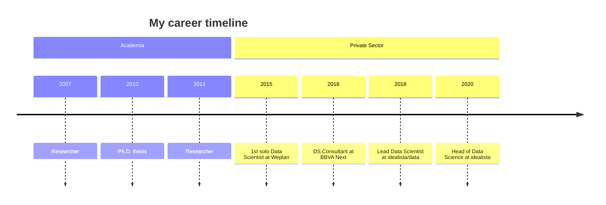

My journey in Data Science began in Academia, where I earned my Ph.D. in Economics and spent 7 years as a researcher. Transitioning to the tech industry, I've held roles as a Senior Data Scientist at BBVA Next and Lead Data Scientist at Weplan before finding my home at idealista where I have worked as Lead Data Scientist and now as a Head of the Data Science initiative.

I'm known for my [ability](My%20failure%20resume.md) to bridge the gap between complex data science concepts and practical applications. I thrive on problem-solving and embrace the challenges of [management](mocs/moc-management.md), tackling everything from strategy and processes to people development.

## My Achievements & Aspirations

Throughout my career, I've had the privilege of working on exciting projects. Some of my proudest moments include:

- Developing a high-impact recommender system with a small team at a large retail company
- Building and nurturing a high-performance data science team at idealista with a large economic impact on the organization through multiple innovation projects.

Looking ahead, I'm driven by the goal of applying my skills to address human challenges on a broader scale. I aspire to be recognized for leading ethical, high-performing teams that delivers outstanding solutions.

# Professional Affiliations and Teaching 

In addition to my role at idealista, I'm deeply committed to nurturing the next generation of Data professionals and sharing my knowledge with the broader community:

- Mentor and Adjunct Professor at [IE School of Science and Technology | SCI TECH](https://www.ie.edu/school-science-technology/)
- Instructor for the Master of Data Science program at [The Valley | Business & Tech School](https://thevalley.es/)
- External teacher at [Dirección y cultura de Producto](https://www.tramontana.net/direccion-producto) en Instituto Tramontana
- [Public speaking](mocs/moc-public-appearances.md)

These teaching and mentoring roles allow me to stay at the cutting edge of data science education while contributing to the growth of our field. They also inform my practical work, keeping me connected to emerging trends and fresh perspectives in data science.

## Beyond the Data

When I'm not immersed in data and management, you can find me:

- Capturing moments through the lens of my analog cameras
- Diving into books on creative processes, management, and philosophy
- Spending quality time with my family

I'm always eager to learn and grow. If you're interested in staying updated on my projects, you can learn more about my [current priorities](https://www.pelayoarbues.com/mocs/now).

## How I Can Help You

My unique blend of academic research, industry experience, and leadership skills allows me to bring substantial value to organizations and projects:

- For businesses: I can help you harness the power of data to drive decision-making, optimize processes, and create data-driven products that resonate with your customers. My experience in developing advanced analytics solutions can directly contribute to your bottom line.
- For data teams: As a leader, I can help build and nurture high-performance teams, bridging the gap between technical expertise and business objectives. I excel at translating complex data concepts into actionable insights for stakeholders at all levels.
- For collaborators and partners: My interdisciplinary background in economics and data science, combined with my problem-solving approach, makes me a valuable partner for innovative projects. Whether it's tackling urban planning challenges or developing new AI-driven solutions, I bring a unique perspective to the table.
- For the broader community: I'm committed to increasing awareness of practical data science applications. Through mentoring, speaking engagements, or collaborative research, I aim to contribute to the growth of our field and its positive impact on society.

## Let's Connect

I love connecting with fellow data enthusiasts, problem solvers, and curious minds. [Feel free to reach out](Office%20hours.md). Whether you want to discuss data science, management strategies, or swap book recommendations, I'm always up for a good conversation!

